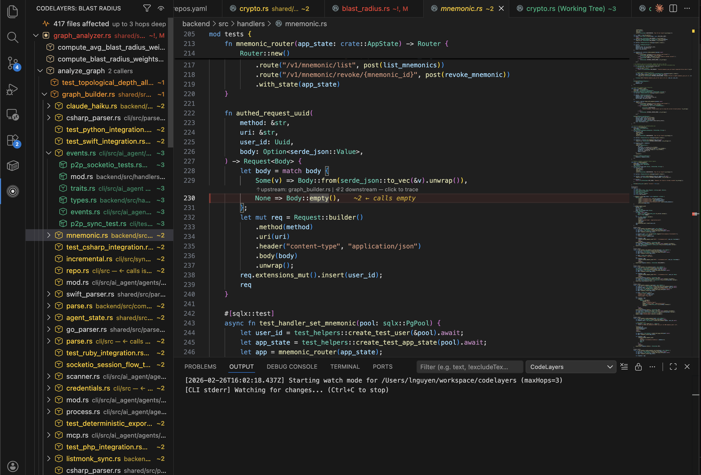
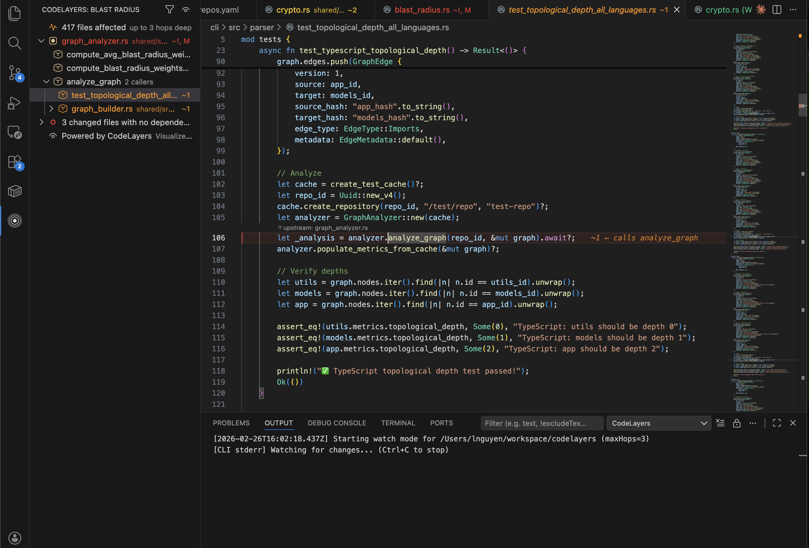
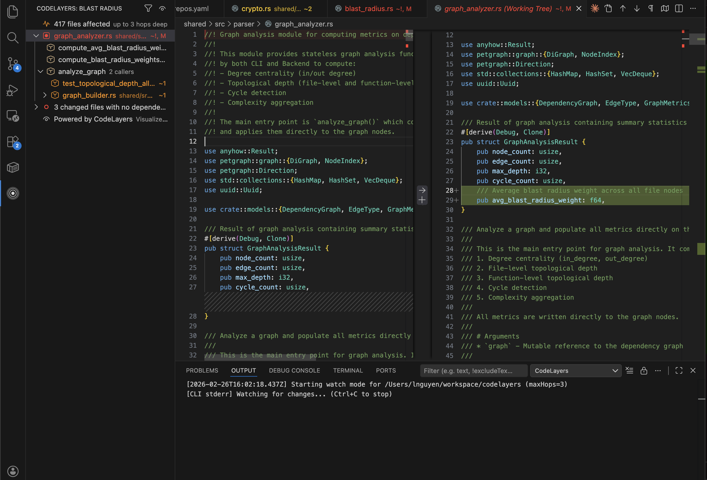

# CodeLayers — Blast Radius

You changed one file. 417 files broke.

CodeLayers shows you the blast radius of every code change before you ship. It traces function calls, imports, and type references through your full dependency graph using [tree-sitter](https://tree-sitter.github.io/) — and updates on every save.

## Zero setup

The CLI installs automatically when you first open the extension. No manual steps.

Works in **VS Code** and **Cursor**.

## Features

**Blast Radius sidebar** — Every affected file grouped by hop distance from your change.

**Hop-colored decorations** — Files are color-coded by distance in the file explorer and editor gutters:
- Red — changed file (hop 0)
- Orange — direct dependents (hop 1)
- Yellow — 2 hops away
- Green — 3 hops away
- Blue — 4+ hops away

**CodeLens annotations** — Inline caller counts and "trace downstream" links above affected symbols.

**Real-time watch mode** — Re-analyzes on every save with 150ms debounce. No manual triggers needed.

**Smart filtering** — Cycle between all dependencies, functions only, or imports only.

**10 languages** — Rust, TypeScript/JavaScript, Python, Java, Go, C++, C#, Ruby, PHP, Swift.

## How it works

1. Open any Git repository
2. The extension starts watching automatically (installs the CLI if needed)
3. Edit and save a file — the sidebar updates with every file affected by your change
4. Click any file in the blast radius to open it with its git diff
5. Use CodeLens links to trace callers upstream or dependents downstream

## CI/CD

Add blast radius to your pull requests with the [CodeLayers GitHub Action](https://github.com/codelayers-ai/codelayers-action). Posts a 3D visualization link as a PR comment automatically.

## Explore any repo

Paste any public GitHub PR or repo URL into [codelayers.ai/explore](https://codelayers.ai/explore) to visualize it in 3D — no account required.

## Settings

| Setting | Default | Description |
|---------|---------|-------------|
| `codelayers.maxHops` | `3` | Maximum dependency chain depth (1-10) |
| `codelayers.showCodeLens` | `true` | Show inline caller counts above symbols |
| `codelayers.defaultFilterMode` | `all` | Filter: `all`, `functions`, or `imports` |
| `codelayers.warningThreshold` | `20` | Status bar warns when this many files are affected |
| `codelayers.cliPath` | auto-detect | Path to `codelayers` binary |

## Commands

All commands are available via the Command Palette (`Cmd+Shift+P`):

- **CodeLayers: Analyze Blast Radius** — Restart analysis
- **CodeLayers: Refresh** — Force refresh
- **CodeLayers: Filter Dependencies** — Cycle filter mode
- **CodeLayers: Toggle Blast Radius On/Off** — Enable/disable
- **CodeLayers: Toggle Blast Radius Decorations** — Show/hide file decorations
- **CodeLayers: Show Callers** — List files that call a symbol
- **CodeLayers: Trace Downstream** — List files that depend on a file
- **CodeLayers: Go to Symbol** — Jump to a symbol definition

## Links

- [codelayers.ai](https://codelayers.ai/)
- [CodeLayers on the App Store](https://apps.apple.com/app/codelayers/id6756067177) (iPhone, iPad, Vision Pro)
- [GitHub Action](https://github.com/codelayers-ai/codelayers-action)

## License

See [LICENSE](LICENSE) for details.
